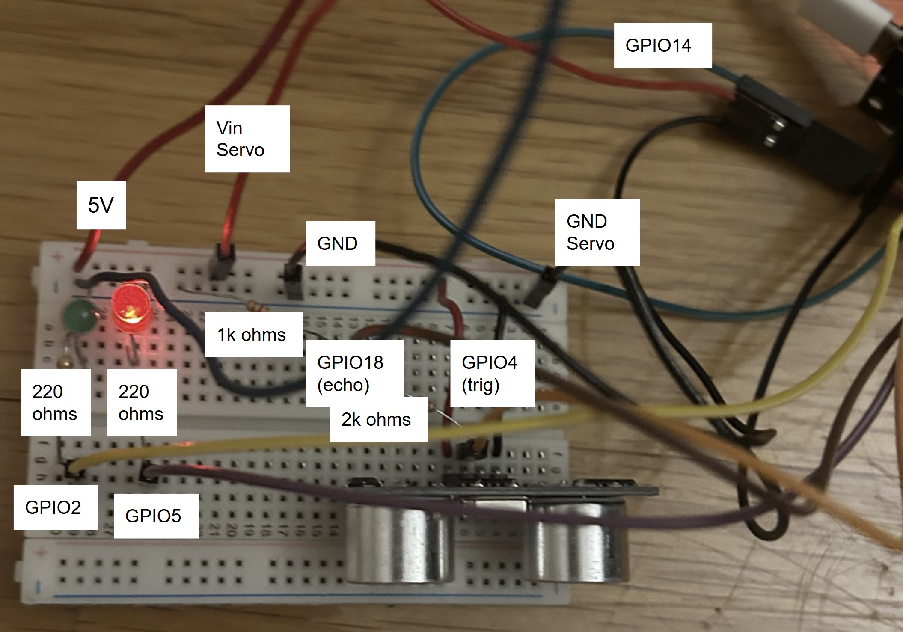
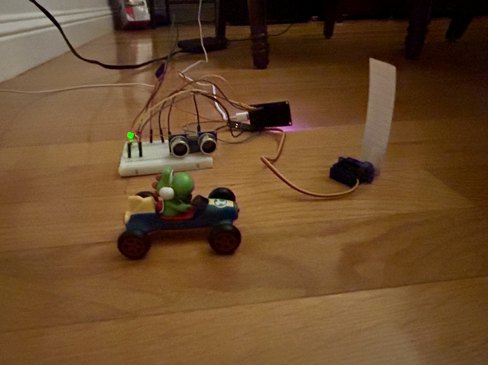

# ESP32-Motion-Activated-Gate
ESP32 powered circuit that uses an ultrasonic sensor and micro servo motor to create a motion activated gate. When a car approaches within the 15 cm threshold, the gate automatically opens.

## How It Works
- The ultrasonic sensor continuously checks distance.
- If an object is detected closer than a threshold (15 cm), the ESP32 activates the servo.
- The servo rotates to open the gate.
- After a short delay, the servo resets to close the gate.
- LEDs indicate gate state (red = closed, green = open).

## Skills Utilized
- Ultrasonic distance sensing (HC-SR04)
- Servo-controlled gate movement (SG90)
- Voltage divider for safe sensor input
- Microcontroller use (ESP32)
- C++

## Hardware
- ESP32 Dev Board
- SG90 Servo Motor
- HC-SR04 Ultrasonic Sensor
- 4x Resistors (1kohm + 2kohm for voltage divider, 2x 220ohms for LEDS)
- 2x LEDs (Red and Green)
- Breadboard & Jumper Wires
- Power Supply (5V)

## Circuit Diagram

## Photo

